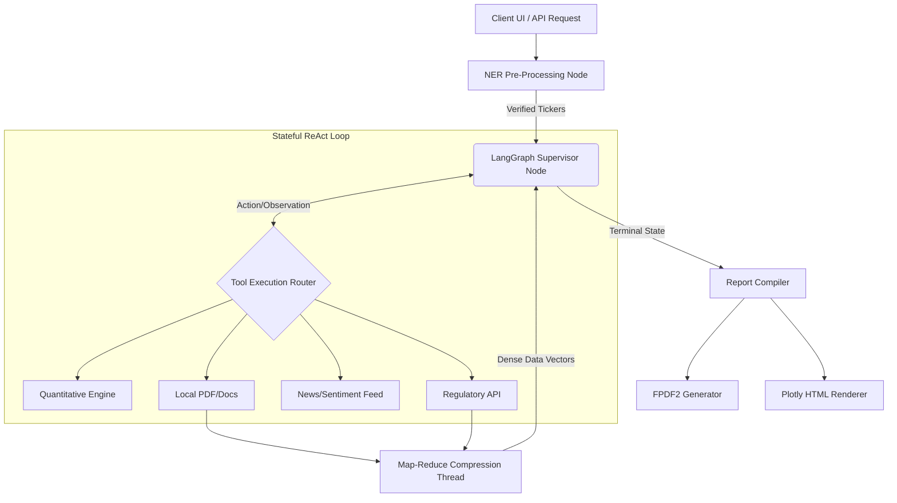

# 🏛️ AlphaIntelligence | Autonomous Financial Research Engine

[](https://www.python.org/)
[](https://langchain-ai.github.io/langgraph/)
[-white.svg?logo=meta&logoColor=blue)](https://ollama.com/)
[](https://pandas.pydata.org/)
[](https://opensource.org/licenses/MIT)

AlphaIntelligence™ is an enterprise-grade, multi-agent financial research framework designed to synthesize real-time market data, regulatory filings, and macroeconomic sentiment into institutional-quality investment briefs. 

By decoupling semantic reasoning from deterministic computation, the engine leverages a **LangGraph-driven ReAct (Reasoning & Action) state machine** to orchestrate localized LLMs (Llama 3.1), vectorized quantitative analysis (NumPy/Pandas), and Map-Reduce context compression.

---

## 🏗️ System Architecture

The core framework operates as a **Cyclic Directed Graph**, bypassing the limitations of traditional linear LLM chains. State is managed centrally via LangGraph checkpointers, allowing the agent to execute tools, evaluate responses, handle API `404` errors dynamically, and self-correct prior to yielding a terminal state.



---

## ⚙️ Technical Implementations

### 1. Deterministic Financial Engineering
LLMs are inherently probabilistic and struggle with complex floating-point arithmetic. AlphaIntelligence solves this by utilizing the LLM strictly as a semantic router. When a user requests a DCF (Discounted Cash Flow) or volatility analysis, the LLM maps the intent to a Python tool node where **Pandas** and **NumPy** execute the vectorized mathematics, ensuring 100% computational accuracy.

### 2. Map-Reduce Context Compression
Ingesting 10-K filings or hour-long earnings transcripts (often 50k+ tokens) directly into an 8B parameter model causes severe context degradation and high latency. 
*   **The Solution:** The system spawns secondary, temperature-0 sub-agents that perform a Map-Reduce pass over raw text. They extract strictly quantitative metrics and forward-looking guidance, compressing the payload by ~85% before returning it to the Supervisor Node's short-term memory.

### 3. Pre-Processing Named Entity Recognition (NER)
To prevent the agent from wasting inference cycles guessing stock tickers (e.g., converting "Apple" to `AAPL`), the UI routes inputs through a highly optimized NER layer. It utilizes a fast dictionary hash-map combined with a JSON-constrained LLM fallback to inject validated ticker arrays directly into the execution state.

### 4. Time-Grounded Checkpointing
Financial data is highly time-sensitive. The Supervisor's System Prompt is dynamically injected with execution-time variables (Year, Quarter, Date) to override the base model's static training cutoff, ensuring the ReAct loop queries current APIs rather than hallucinating historical data.

---

## 📡 Data Ingestion Pipelines

| Subsystem | Provider / Library | Purpose | Architecture Note |
| :--- | :--- | :--- | :--- |
| **Market Data** | `yfinance` / Finnhub | Pricing, Ratios, Balance Sheets | Cached DataFrames via Pandas |
| **Regulatory** | SEC EDGAR API | 10-K, 10-Q, 8-K Extraction | Automated CIK normalization & rate-limit compliance |
| **Transcripts** | FMP API | Earnings Call Guidance | Piped through the Context Compressor |
| **Macro/News** | NewsAPI / Tavily | Geopolitical & Sector Sentiment | Fallback routing enabled for redundancy |
| **Document Parsing**| `PyMuPDF` (Fitz) | Local PDF ingestion | Page-chunked parallel extraction |

---

## 📦 Prerequisites & Installation

### System Requirements
*   **Python:** `3.11.x` or higher
*   **Package Manager:** `uv` (Recommended for hyper-fast dependency resolution)
*   **Local Inference:** [Ollama](https://ollama.com/) installed and running on `localhost:11434`.

### Installation Steps

1. **Clone the repository:**
   ```bash
   git clone [https://github.com/yourusername/alpha-intelligence.git](https://github.com/yourusername/alpha-intelligence.git)
   cd alpha-intelligence
   ```

2. **Pull the Local LLM:**
   Ensure the Ollama daemon is running, then download the specific model weight:
   ```bash
   ollama pull llama3.1:8b
   ```

3. **Resolve Dependencies:**
   ```bash
   uv sync
   ```

---

## 🔐 Configuration & Environment

The engine requires external API access for real-time aggregation. Create a `.env` file in the root directory:

```env
# Essential Analytics Feeds
FINNHUB_API_KEY="your_finnhub_key_here"
FMP_API_KEY="your_financial_modeling_prep_key"

# Alternative Data & Web Search
TAVILY_API_KEY="tvly-xxxxxxxxxxxxxxxxxxxxxxxx"
NEWSAPI_KEY="your_newsapi_key_here"

# Regulatory Compliance (Mandatory for SEC EDGAR access)
SEC_USER_AGENT="YourEnterpriseName contact@yourdomain.com"
```

---

## 🚀 Usage

### 1. Web Application (Streamlit)
Launch the graphical decentralized terminal for client-facing operations:
```bash
uv run streamlit run app.py
```

### 2. Programmatic Execution (Headless)
Integrate the execution graph directly into existing data pipelines:
```python
from langchain_core.messages import HumanMessage
from agent.graph import agent_app
from utils.ticker_resolver import resolve_query_tickers

query = "Run a comparative DCF valuation between NVDA and AMD."
tickers = resolve_query_tickers(query)

inputs = {"messages": [HumanMessage(content=f"{query} (Target Tickers: {tickers})")]}
config = {"configurable": {"thread_id": "batch_process_01"}}

# Execute the DAG
for event in agent_app.stream(inputs, config, stream_mode="values"):
    last_message = event["messages"][-1]
    if hasattr(last_message, 'tool_calls') and last_message.tool_calls:
        for tool in last_message.tool_calls:
            print(f"[SYSTEM] Routing to subsystem: {tool['name']}")

print("\n--- FINAL REPORT ---\n")
print(last_message.content)
```

---

## 📁 Directory Structure

```text
alpha-intelligence/
├── agent/
│   └── graph.py               # LangGraph ReAct initialization and state routing
├── tools/
│   ├── __init__.py            # Tool registry array
│   └── financial_tools.py     # API wrappers, Pandas math, Context Compressor
├── utils/
│   ├── pdf_generator.py       # FPDF2 serialization for Markdown-to-PDF
│   └── ticker_resolver.py     # NLP Named Entity Recognition engine
├── memory/
│   └── episodic.py            # SQLite/JSON localized memory checkpointing
├── app.py                     # Streamlit frontend architecture
├── config.py                  # Loguru telemetry configuration
├── pyproject.toml             # Dependency specification
└── .env                       # Environment secrets
```

---

## 📉 Telemetry & Logging

Standard `print()` statements are deprecated. The system utilizes `loguru` for asynchronous, thread-safe logging. All API faults, context bounds, and tool executions are piped to rolling files.

**Location:** `logs/agent_system.log`

```text
2026-07-03 13:24:17 | INFO  | analyze_historical_trends:198 - Initiating historical trend engine: NVDA
2026-07-03 13:24:21 | DEBUG | process_local_pdf_document:55 - Spawning Map-Reduce compression thread.
2026-07-03 13:24:25 | INFO  | analyze_historical_trends:244 - Plotly visualization compiled successfully.
```

---

## 🔌 Extensibility (Custom Tools)

To add proprietary internal data feeds (e.g., Snowflake warehouse, Bloomberg Terminal API), define a new tool in `tools/financial_tools.py` using the standard `@tool` decorator. 

Type hints and docstrings are **mandatory**, as the Llama 3.1 function-calling schema relies heavily on introspection to map arguments.

```python
from langchain_core.tools import tool
from loguru import logger

@tool
def query_internal_alpha_database(ticker: str, metric: str) -> str:
    """
    Queries the internal data warehouse for proprietary alternative data.
    Requires exactly one ticker symbol (e.g., 'AAPL') and a specific metric.
    """
    logger.info(f"Accessing internal warehouse for {ticker}")
    # ... Implementation logic ...
    return f"Internal Alpha Data for {ticker}: ..."
```

*Register the function in the `FINANCIAL_TOOLS` array inside `tools/__init__.py` to expose it to the graph.*

---

## ⚖️ Disclaimer

*AlphaIntelligence is an experimental software architecture demonstration. It does not constitute financial advice. The models may hallucinate, and APIs may provide delayed or inaccurate pricing data. Do not execute live trades based solely on the outputs of this framework.*
