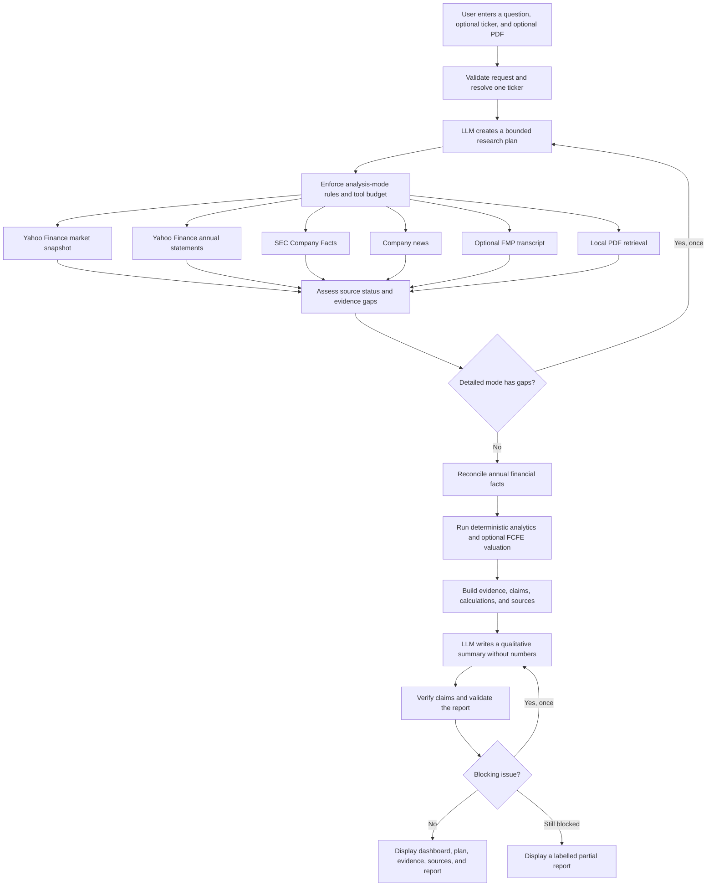

[](https://www.python.org/)
[](https://streamlit.io/)
[](https://www.langchain.com/langgraph)
[](https://www.langchain.com/)
[](https://pandas.pydata.org/)
[](https://docs.pydantic.dev/)
[](https://pypi.org/project/yfinance/)
[](https://pymupdf.readthedocs.io/)
[](#supported-model-providers)
[](https://docs.astral.sh/uv/)
[](#tests-and-evaluation)
[](#tests-and-evaluation)


# AI Financial Research Assistant

This project is a local Streamlit application for researching one publicly traded company at a time. It combines market data, annual financial statements, SEC filing facts, company news, optional earnings-call transcripts, and evidence from an uploaded PDF. Deterministic code calculates financial trends and an FCFE valuation, while a selected language model plans the research and writes a constrained qualitative summary.

## 1. Project overview

The application brings several parts of single-company financial research into one interface. A user supplies a research question and, optionally, a ticker and supporting PDF. The application selects from a fixed set of read-only research tools, records the sources it used, reconciles comparable financial values, calculates metrics, and produces a report with evidence and calculation traces.

It is useful for developers studying tool-based language-model workflows, students learning financial analysis, recruiters or interviewers reviewing an applied AI project, and analysts who want a local research aid.

The project is intended for educational and informational use. It does not provide personal financial advice, make buy/hold/sell recommendations, construct portfolios, or execute trades.

## 2. What the application can do

- Research one public-company ticker in each run. A ticker can be entered directly; several common company names and symbols can also be resolved from the question.
- Retrieve a market snapshot and six months of daily closing-price history from Yahoo Finance through `yfinance`. If a fast quote is unavailable, the latest daily close is clearly labelled as the fallback.
- Retrieve and align up to five annual income-statement, cash-flow, and balance-sheet periods from `yfinance`.
- Retrieve selected SEC EDGAR Company Facts when a valid SEC User-Agent is configured. Supported facts include revenue, net income, assets, cash, and debt, with filing form, period, accession number, taxonomy, concept, and selection context when available.
- Keep annual, quarter-only, year-to-date, and point-in-time SEC contexts separate.
- Reconcile comparable annual SEC revenue and net-income facts with provider statements. The SEC value becomes canonical only when concept, duration, period, unit, and currency checks pass. Differences greater than 1% remain visible instead of being averaged away.
- Calculate annual revenue growth, revenue CAGR, net margin, free-cash-flow margin, net cash or debt, and historical direction without filling in missing observations.
- Display deterministic charts for market price, revenue, net income, operating cash flow, free cash flow, cash, debt, growth, and margins when the required data exists.
- Build a transparent financial scorecard covering profitability, growth, cash flow, balance sheet, valuation, and evidence completeness. Missing components are not assigned neutral scores.
- Run an FCFE discounted-cash-flow valuation only when the question asks for valuation. The model produces bear, base, and bull cases plus a discount-rate and terminal-growth sensitivity table.
- Retrieve up to six deduplicated, company-relevant news items from Yahoo Finance and show why each item passed the relevance filter.
- Retrieve an actual earnings-call transcript from Financial Modeling Prep when an optional FMP key is configured and the question includes a quarter and year, such as `Q2 2025`.
- Extract text from one uploaded PDF in the Streamlit interface, preserve page numbers, split pages into overlapping chunks, and search them locally with BM25 plus a small finance-concept similarity model. No paid embedding service or persistent vector database is used.
- Flag instruction-like text in uploaded documents as untrusted evidence. Uploaded passages are treated as data, not instructions to the language model.
- Ask the selected language model to create a bounded research plan using allowlisted, read-only tools. Invalid planner output falls back to a deterministic safe plan.
- Use Quick, Standard, or Detailed analysis modes. Detailed mode can revise the plan once when required evidence is missing.
- Build claim-level evidence links and calculation lineage, then recompute allowlisted calculations before accepting them.
- Report missing, partial, stale, conflicting, or unavailable data rather than inventing replacements.
- Generate a structured Markdown report with an executive summary, historical analysis, profitability, cash flow and balance sheet, valuation, recent developments, document evidence, data gaps, scorecard, evidence quality, qualitative conclusion, sources, and disclaimer.
- Validate reports for issues such as unsupported claims, uncalculated DCF values, mixed FCFE/FCFF terminology, direct trading recommendations, duplicate conclusions, future events described as completed, and news presented as a transcript. One controlled regeneration is attempted if validation blocks the first report.
- Download the Markdown report, evidence and calculation data as JSON, and a run manifest containing the plan, tool calls, source states, timing, model information, token metadata when available, and validation result.
- Use OpenAI, Google Gemini, Anthropic, or a local Ollama server through a common LangChain interface. The UI supports suggested models and custom model names.

## 3. Questions the project can answer

The wording below is illustrative. Results depend on source availability and the selected analysis depth.

### Financial overview

- Give me a financial overview of Microsoft.
- Summarise Apple's latest annual financial performance.
- Explain Meta's revenue, profit, cash flow, and debt position.

### Historical analysis

- How has Microsoft's revenue changed over recent years?
- Is Apple's free cash flow improving?
- Show NVIDIA's revenue and net-income trend.
- How have cash, debt, and diluted shares changed across the available annual periods?

### Filing questions

- What revenue did Microsoft report in its latest annual filing?
- Which SEC filing supports this financial value?
- Are the SEC and provider values different?
- Show the filing form, period, and accession information for the selected SEC fact.

### Valuation

- Run an FCFE valuation for Microsoft.
- Show bear, base, and bull valuation scenarios.
- Explain how the valuation changes with the cost of equity.
- Compare the current market price with the modelled FCFE range.

### News and transcripts

- Summarise recent company news for Microsoft.
- Review the Q2 2025 earnings-call transcript for MSFT.
- What evidence is unavailable if no transcript provider is configured?

### Uploaded document questions

- Summarise the main risks in this uploaded annual report.
- Find what the PDF says about AI capital expenditure.
- Which page discusses liquidity risk?
- Compare the uploaded document evidence with the available financial data.

## Questions currently outside the main scope

- Comparing several companies in one run
- Portfolio construction, allocation, or risk management
- Screening hundreds of stocks
- Automated trading or brokerage integration
- Personal investment recommendations
- Guaranteed live or real-time prices
- Short-term price prediction
- Research on private companies without a supported public ticker
- Dedicated workflows for funds, bonds, options, cryptocurrencies, commodities, or other unsupported asset classes
- OCR for scanned or image-only PDFs
- Full filing-document retrieval from EDGAR; the SEC integration uses the Company Facts API

## 4. How the project works



The language model does not calculate the financial tables. It selects from a fixed tool list and writes only the qualitative conclusion, risk, and assumption sections. Market values, annual trends, ratios, scorecard inputs, valuation results, citations, and most report sections are created from structured data by deterministic code.

### Analysis depth

| Mode | Tool budget | Enforced source behavior |
| --- | ---: | --- |
| Quick | 3 | Market snapshot and annual financial statements. Valuation is added only when requested. |
| Standard | 6 | Quick sources plus SEC Company Facts and company news. Transcript, PDF retrieval, and valuation are added when relevant and requested. |
| Detailed | 8 | Standard behavior plus at most one evidence-gap replan. Uploaded-document retrieval is included when a PDF is supplied. |

Every mode remains bounded by its tool budget. Market data and annual statements are required by policy; conditional tools are accepted only when the request supports them.

## Information sources

| Source | Purpose | Required configuration | Important behavior |
| --- | --- | --- | --- |
| Yahoo Finance through `yfinance` | Market snapshot, six-month daily price history, annual statements, and company news | None | Availability and fallback price basis are shown. Data may be delayed or incomplete. |
| SEC EDGAR Company Facts | Official XBRL facts and filing metadata | `SEC_USER_AGENT` with an application name and contact email | SEC access is disabled when the User-Agent is absent or invalid. Requests are rate-spaced, retried, and cached per client. |
| Financial Modeling Prep | Optional earnings-call transcript | `FMP_API_KEY` | The request must identify a quarter and year. Returned text is limited to 50,000 characters for analysis. |
| Uploaded PDF | User-supplied supporting evidence | Text-based PDF within the configured size limit | Processed in memory. Page-aware retrieval uses local concept similarity plus BM25. Scanned PDFs need OCR, which is not included. |
| Selected LLM provider | Research planning and constrained qualitative synthesis | Cloud API key, or a running Ollama server | The model is not used as the source of numerical financial values. |

Source calls return structured availability states. A run can therefore finish with partial results when an optional or external source is unavailable.

## FCFE valuation

The implemented DCF is explicitly an FCFE model:

- Base cash flow is the latest available levered free cash flow.
- Cash flows are projected for 1 to 10 years.
- The discount rate is treated as the cost of equity.
- Terminal value uses the perpetual-growth method and requires terminal growth to be below the discount rate.
- Bear and bull assumptions are derived around the user-supplied base assumptions.
- Equity value is divided by diluted shares for per-share value.
- Cash and debt are shown for context but are not added or subtracted, because FCFE is already an equity cash flow.
- Missing free cash flow or diluted shares prevents the public valuation tool from returning a valuation.
- Negative free cash flow is allowed but produces a warning.
- A warning is shown when terminal value exceeds 75% of modelled equity value.

The result is an educational, assumption-sensitive estimate, not a recommendation.

## User interface and outputs

The Streamlit sidebar contains:

- Provider, model, optional custom model, API key, temperature, and Ollama URL controls
- A connection test
- Optional SEC User-Agent and FMP key fields
- Analysis-mode guidance
- A session reset control

The main input area contains the research question, optional ticker, analysis depth, one optional PDF upload, and FCFE assumptions. After a run, the interface shows:

- Executive dashboard cards
- Six-month price history and source-quality status
- Annual financial charts and deterministic observations
- Financial scorecard and scoring traces
- FCFE inputs, scenarios, comparison, warnings, and sensitivity table
- Research-plan steps, gaps, reconciliation details, and run summary
- Claim-level evidence and report-validation results
- Deduplicated sources and data-quality records
- The complete Markdown report

The Full report tab provides these downloads:

- `<TICKER>_financial_research.md`
- `<TICKER>_evidence.json`
- `<TICKER>_run_manifest.json`

## Requirements

- Python 3.11, 3.12, or 3.13
- [`uv`](https://docs.astral.sh/uv/) for the documented commands
- Internet access for Yahoo Finance, SEC, cloud LLMs, and optional FMP data
- One of:
  - an OpenAI API key
  - a Google Gemini API key
  - an Anthropic API key
  - a local Ollama server and installed model

The repository pins a Python 3.11 development version in `.python-version`.

## Installation

Clone or open the project directory, then install the locked dependencies:

```bash
uv sync --extra dev --locked
```

Create a local environment file from the example:

```powershell
Copy-Item .env.example .env
```

On macOS or Linux:

```bash
cp .env.example .env
```

Edit `.env` as needed:

```dotenv
OPENAI_API_KEY=
ANTHROPIC_API_KEY=
GOOGLE_API_KEY=

OLLAMA_BASE_URL=http://localhost:11434
OLLAMA_MODEL=llama3.1:8b

SEC_USER_AGENT=FinancialAnalystAgent/3.0 contact@example.com
FMP_API_KEY=

REQUEST_TIMEOUT_SECONDS=20
RETRY_COUNT=2
UPLOAD_SIZE_LIMIT_MB=10
```

Keys entered in the Streamlit UI take precedence over environment keys for that session. A cloud provider requires its matching key. Ollama does not require an API key, but its server and selected model must be available.

Replace the example SEC contact address before using SEC data. The optional FMP key is needed only for transcript requests.

## Run the application

```bash
uv run streamlit run app.py
```

Streamlit prints a local URL, normally `http://localhost:8501`. In the application:

1. Select a provider and model.
2. Enter the provider key in the sidebar or load it from `.env`. For Ollama, confirm the base URL.
3. Optionally test the connection.
4. Add a valid SEC User-Agent if SEC facts are required.
5. Enter a research question and, if needed, a ticker.
6. Select Quick, Standard, or Detailed analysis.
7. Optionally upload a text-based PDF and adjust FCFE assumptions.
8. Run the analysis and inspect the data-quality, evidence, and source tabs alongside the report.

Example valuation request:

```text
Run an FCFE valuation for MSFT and explain its annual revenue, cash-flow, and debt trends.
```

Example transcript request:

```text
Review the Q2 2025 earnings-call transcript for MSFT and compare it with the annual financial direction.
```

The quarter and year are required for transcript retrieval. Valuation terms such as `DCF`, `valuation`, `intrinsic value`, or `fair value` are required for the valuation tool to run.

## Configuration reference

| Variable | Default | Purpose |
| --- | --- | --- |
| `OPENAI_API_KEY` | empty | OpenAI authentication |
| `ANTHROPIC_API_KEY` | empty | Anthropic authentication |
| `GOOGLE_API_KEY` | empty | Google Gemini authentication |
| `OLLAMA_BASE_URL` | `http://localhost:11434` | Local Ollama endpoint |
| `OLLAMA_MODEL` | `llama3.1:8b` | Environment-backed Ollama model setting |
| `SEC_USER_AGENT` | empty in application settings | SEC application identity and contact address |
| `FMP_API_KEY` | empty | Optional transcript access |
| `REQUEST_TIMEOUT_SECONDS` | `20` | External request and model timeout; allowed range is greater than 0 through 120 seconds |
| `RETRY_COUNT` | `2` | HTTP retry count for SEC and FMP; allowed range is 0 through 5 |
| `UPLOAD_SIZE_LIMIT_MB` | `10` | PDF upload limit; allowed range is 1 through 50 MB |

The Streamlit server configuration also sets its upload limit to 10 MB. If the application setting is increased, the Streamlit setting must be adjusted separately.

## Supported model providers

The UI currently suggests the following model names, and also accepts a custom provider model name:

| Provider | Suggested models |
| --- | --- |
| OpenAI | `gpt-4.1-mini`, `gpt-5-mini`, `gpt-4.1` |
| Google Gemini | `gemini-3.5-flash`, `gemini-3.1-flash-lite`, `gemini-2.5-pro` |
| Anthropic | `claude-sonnet-4-6`, `claude-haiku-4-5-20251001`, `claude-sonnet-4-5-20250929` |
| Ollama | `llama3.1:8b`, `qwen3:8b`, `mistral:7b` |

Temperature is omitted for configured OpenAI reasoning-model families (`gpt-5`, `o1`, `o3`, and `o4`) and Gemini 3 models because those APIs reject or ignore it.

An optional command-line provider smoke test is also available:

```bash
uv run python -m financial_analyst.llm --provider "OpenAI" --model "gpt-4.1-mini"
```

This command makes a live provider request and uses the matching environment configuration.

## Tests and evaluation

Run the offline test suite:

```bash
uv run pytest
```

The tests block live network connections and use fixtures or fakes for external services. They cover provider configuration, ticker validation, source behavior, SEC context selection, PDF processing and retrieval, valuation, claim verification, report validation, Streamlit smoke behavior, and the complete mocked workflow.

Run the deterministic offline evaluation:

```bash
uv run python -m financial_analyst.evaluation
```

The evaluation runs 53 fixture tasks and checks thresholds for:

- Numerical accuracy
- SEC fact selection
- Research-plan precision and recall
- Document retrieval recall
- Citation precision and recall
- Unsupported-claim rate
- Report consistency
- Source-conflict detection
- Provider planner-format handling

Run the same local quality checks used by CI:

```bash
uv run ruff check .
uv run ruff format --check .
uv run pytest
uv run python -m financial_analyst.evaluation
uv run python -m compileall -q app.py financial_analyst tests
```

The GitHub Actions workflow installs the locked development environment and runs those checks on pushes and pull requests.

## Project structure

```text
.
|-- app.py                         # Streamlit entry point and session controls
|-- financial_analyst/
|   |-- analytics.py               # Historical metrics, dashboard, quality, and scorecard
|   |-- config.py                  # Environment and provider settings
|   |-- documents.py               # PDF extraction, chunking, retrieval, and semantic gate
|   |-- evaluation.py              # Offline 53-task benchmark
|   |-- evidence.py                # Evidence, sources, claims, and report validation
|   |-- llm.py                     # Provider factory and research planning
|   |-- market.py                  # yfinance market, statement, and news access
|   |-- models.py                  # Typed request, source, evidence, and result models
|   |-- reporting.py               # Deterministic report assembly and constrained synthesis
|   |-- sec.py                     # SEC Company Facts selection and reconciliation
|   |-- security.py                # Credential redaction, logging, and session IDs
|   |-- tools.py                   # Allowlisted research-tool registry
|   |-- transcripts.py             # Optional FMP transcript client
|   |-- ui.py                      # Streamlit dashboard and tab renderers
|   |-- valuation.py               # FCFE scenarios, sensitivity, and calculation checks
|   `-- workflow.py                # LangGraph research workflow
|-- tests/
|   |-- fixtures/                  # Offline SEC fixtures
|   `-- test_*.py                  # Unit, integration, evaluation, and UI smoke tests
|-- .github/workflows/ci.yml       # Automated quality checks
|-- .streamlit/config.toml         # Streamlit theme and upload limit
|-- .env.example                   # Optional local configuration template
|-- pyproject.toml                 # Package metadata and dependencies
|-- uv.lock                        # Locked dependency versions
`-- README.md
```

Local caches, logs, Python build metadata, and archived project files are not part of the application architecture and are omitted from this tree.

## Data handling and security notes

- UI-entered API keys are held in Streamlit session state and are not written by the application.
- Environment keys are read from `.env` when present.
- Error messages and the rotating local application log redact common credential formats.
- Prompt text and uploaded-document text are not written to the application log.
- Uploaded PDFs are parsed from bytes in memory. The session keeps at most four parsed-PDF cache entries and clears them on session reset.
- File names are sanitized, file-size and PDF-signature checks are applied, and arbitrary local file paths are not accepted.
- Source clients use bounded in-memory caches. No research database or persistent vector store is included.
- Resetting the session clears results, uploads, UI-entered keys, and per-run data clients.

## Known limitations

- External data can be missing, stale, delayed, rate-limited, or shaped differently from the expected provider response.
- Yahoo Finance is the core source for market and annual statement data. The application does not guarantee exchange-grade real-time quotes.
- SEC reconciliation is intentionally narrow. It selects comparable revenue and net-income facts; it does not reconcile every XBRL concept.
- Company-news filtering is rule-based and may omit relevant items or retain imperfect matches.
- Transcript retrieval depends on the optional FMP endpoint and exact quarter/year input.
- PDF retrieval uses a compact local finance vocabulary rather than a general-purpose embedding model. It works best for financial concepts represented by that vocabulary and by shared keywords.
- Only extractable PDF text is supported. There is no OCR, table reconstruction, or image analysis.
- Language-model planning and qualitative wording can vary by provider and model. Deterministic policy checks limit tool selection and numerical generation, but they do not eliminate every possible model error.
- A run may return a clearly labelled partial report when consistency validation still fails after one retry.
- The scorecard and evidence-quality score are documented research rubrics, not investment ratings or model confidence probabilities.

## Disclaimer

This project is for informational and educational purposes only. It is not financial advice, an offer, or a recommendation to buy or sell any security. Verify important figures against primary filings and qualified professional advice before making financial decisions.
